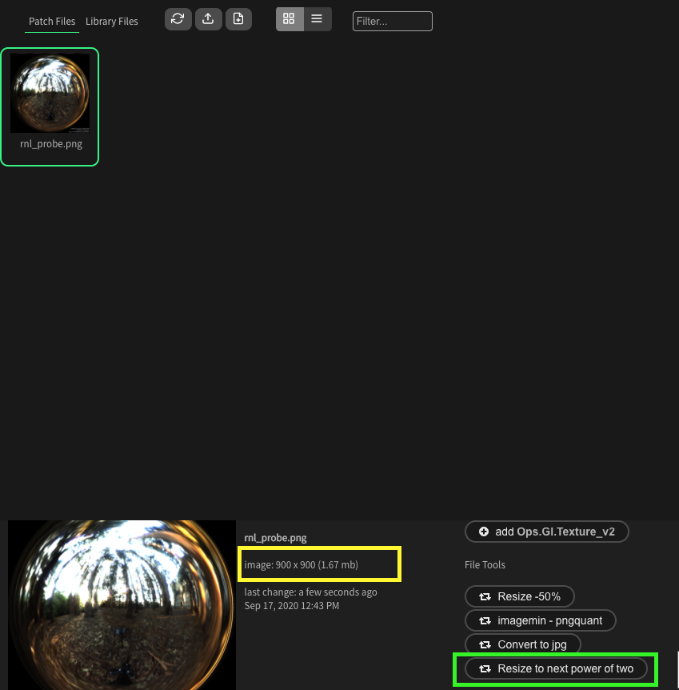

# WebGL1 and WebGL2

## A little overview

The underlying interface that allows 3D graphics on the web to be rendered natively is called WebGL. WebGL was first released in 2011 with WebGL1. WebGL2, the next iteration of WebGL, was made availible in 2017. WebGL2 features new features. If you are interested in the details of the specification & differences, have a look [here](https://webgl2fundamentals.org/webgl/lessons/webgl2-whats-new.html).

## Why would this matter to you, the user?

**WebGL2** has been adopted by most of modern browsers (**Chrome, Firefox, Opera, Edge**).

There are two platforms that still use **WebGL1**: **macOS (Safari) and iOS (every browser)**. If you plan on making your patch functional for these platforms, there are a few things to keep in mind:

## MipMapping & Power of Two Textures

WebGL1 only supports [mipmapping]() for power of two textures. What does that mean?

### First off, what is mipmapping?

Put simply, mipmapping saves your texture in different resolutions internally so the graphics card can choose which resolution is optimal to display your texture without artifacts. See the following picture for a visual explanation:

[Source 1]: https://en.wikipedia.org/wiki/Mipmap#/media/File:Mipmap_Aliasing_Comparison.png

As you can see, there are moiré artefacts in the background without mipmapping. These disappear when mipmapping is enabled.
When using the [Texture op](https://cables.gl/op/Ops.Gl.Texture_v2), mipmapping is enabled automatically.

### Mipmapping in WebGL1

WebGL1 allows mipmapping only for textures that have dimensions that are a power of two.

What does that mean?

Here are the powers of two: `0, 1, 2, 4, 8, 16, 32, 64, 128, 256, 512, 1024, 2048, 4096, ...`

Mipmap filtering will only work if the dimensions, the *width* and the *height*, of the texture are one of these numbers. Width and height do **not** need to be the same size, but both values need to be a power of two.

Texture dimension examples that work: `1024 by 1024`, `256 by 2048`, `512 by 128` and so on.

Texture dimension examples that do not work: `1038 by 2030`, `540 by 1300`, ...

### Scaling a texture to the next power of two

Fortunately, cables allows you to resize a texture to the closest power of two within the application:

If you open the file browser and click on the texture you desire to resize, the following options will appear:

If you look at the bottom of the screenshot, you can see marked in yellow the current size of your image. At the bottom right of your dimensions, there are a few buttons that allow you to process your image through cables. The relevant button to resize to the next power of two is marked in bright green.

After clicking it, a dialogue appears and asks you if you want to resize the texture. If you do that, the following dialogue will appear:

Your texture is now resized to the next power of two and usable for mipmapping in WebGL1.

### Mipmapping in WebGL2

Mipmapping in WebGL2 works for every resolution.
